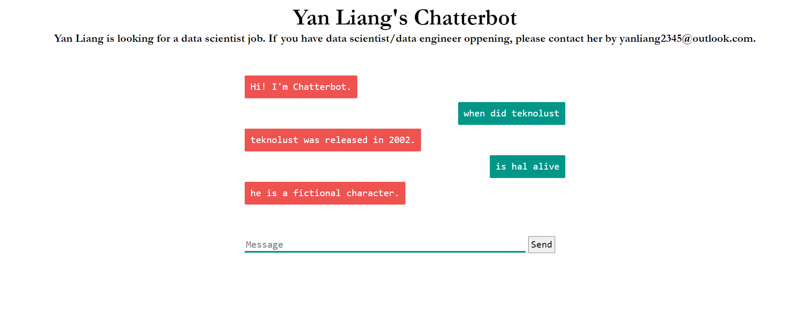

building the docker

```bash
docker build -t yanliang12/yan_flask_chatterbot:1.0.1 .
```

start the docker

```bash
docker run -it `
-p 0.0.0.0:5000:5000 `
yanliang12/yan_flask_chatterbot:1.0.1
```

visit the UI at

http://localhost:5000/




